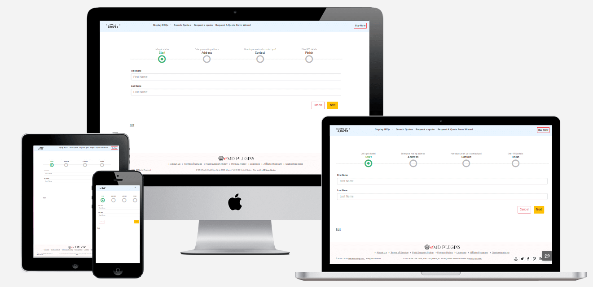

<!-- PROJECT LOGO -->
 

  

  <h3 align="center">Request a quote</h3>

  

    Request a quote is designed for small business owners to receive inquiry or quote requests from customers.
     
     
     <a href="https://github.com/emarket-design/request-a-quote/issues">Report Bug</a>
    ·
    <a href="https://github.com/emarket-design/request-a-quote/issues">Request Feature</a>
     

<!-- ABOUT THE PROJECT -->
## About The Project

Request A Quote provides a faster, easier, and better way for quoting and winning more business.

### Related WordPress Plugins

* [WP Ticket Starter](https://wpticketcom.emdplugins.com/) Powerful customer support and helpdesk ticketing system.
* [Software Issue Manager Starter](https://simcom.emdplugins.com/) The best in class issue and project management solution for successful projects.
* [Employee Directory Starter](https://employee-directory-com.emdplugins.com) The most complete employee directory software to power up your business.
* [WP Easy Contact Starter](https://wpeasycontactcom.emdplugins.com) Complete contact management solution to start, develop and grow your customer relationships.
* [Knowledge Center Starter](https://kcentercom.emdplugins.com/) Great knowledge base software for helping your customers and employees to find answers faster.
* [Employee Spotlight Starter](https://espotlight-com.emdplugins.com) Everything you need to display and manage staff profiles.
* [Campus Directory Starter](https://campusdircom.emdplugins.com) The Best Campus Directory for Higher Education Institutions.

### Features

* [Accept requests from anywhere anytime](https://emdplugins.com/?p=18061&pk_campaign=request-a-quote-com&pk_kwd=github)
* [Allow clients upload files](https://emdplugins.com/?p=18068&pk_campaign=request-a-quote-com&pk_kwd=github)
* [Customize most without writing code](https://emdplugins.com/?p=18067&pk_campaign=request-a-quote-com&pk_kwd=github)
* [One place for all requests for quotes](https://emdplugins.com/?p=18060&pk_campaign=request-a-quote-com&pk_kwd=github)
* [Customize price quote request form with a few clicks
](https://emdplugins.com/?p=18062&pk_campaign=request-a-quote-com&pk_kwd=github)
* [Customize your and customer email notifications](https://emdplugins.com/?p=18066&pk_campaign=request-a-quote-com&pk_kwd=github)
* [Multi-dimensional spam protection](https://emdplugins.com/?p=18063&pk_campaign=request-a-quote-com&pk_kwd=github) - Premium feature (included in Pro)
* [Categorize requests for quotes for faster searches](https://emdplugins.com/?p=18065&pk_campaign=request-a-quote-com&pk_kwd=github) - Premium feature (included in Pro)
* [Assign requests to your sales team members](https://emdplugins.com/?p=32349&pk_campaign=request-a-quote-com&pk_kwd=github) - Premium feature (included in Pro)
* [Route RFQs to appropriate staff based on time past](https://emdplugins.com/?p=33680&pk_campaign=request-a-quote-com&pk_kwd=github) - Premium feature
* [Complete specific action s on RFQ data based on specific conditions](https://emdplugins.com/?p=33681&pk_campaign=request-a-quote-com&pk_kwd=github) - Premium feature
* [Design submission and search forms with powerful EMD Form Builder](https://emdplugins.com/?p=36201&pk_campaign=request-a-quote-com&pk_kwd=github) - Premium feature (included in Pro)
* [Add your own fields to better match your need](https://emdplugins.com/?p=18064&pk_campaign=request-a-quote-com&pk_kwd=github) - Premium feature (included in Pro)
* [Sign up customers to your MailChimp list with ease](https://emdplugins.com/?p=18071&pk_campaign=request-a-quote-com&pk_kwd=github) - Add-on
* [Find important requests for quotes faster](https://emdplugins.com/?p=18069&pk_campaign=request-a-quote-com&pk_kwd=github) - Add-on (included in Pro)
* [Accept requests for quotes from customer emails](https://emdplugins.com/?p=18072&pk_campaign=request-a-quote-com&pk_kwd=github) - Add-on
* [Bulk import, export or update quote or information requests from CSV](https://emdplugins.com/?p=18070&pk_campaign=request-a-quote-com&pk_kwd=github) - Add-on (included in Pro)

<!-- GETTING STARTED -->
## Getting Started

### Watch Introduction Video 

 

To get a local copy up and running follow these simple example steps.

### Request a quote WordPress Plugin Links

 * [Request a quote Starter Demo Site](https://requestaquote.emdplugins.com/?pk_campaign=request-a-quote-com&pk_kwd=readme)
* [Request a quote Starter Documentation](https://docs.emdplugins.com/request-a-quote-community/?pk_campaign=request-a-quote-com&pk_kwd=readme)
* [Request a quote Professional Demo Site](https://raqpro.emdplugins.com?pk_campaign=request-a-quote-com&pk_kwd=readme)
* [Request a quote Professional Documentation](https://docs.emdplugins.com/request-a-quote-professional/?pk_campaign=request-a-quote-com&pk_kwd=readme)
* [Request a quote Professional Changes](https://emdplugins.com/articles/request-a-quote-pro-wordpress-plugin-changelog/?pk_campaign=request-a-quote-com&pk_kwd=readme)

### Installation

#### Using This Page
* Click on Clone or Download button on this page. Click, and you can see a drop-down box having two options, click on Download ZIP.
* Login to your website and go to the Plugins section of your admin panel.
* Click the Add New button.
* Under Install Plugins, click the Upload link.
* Select the plugin zip file from your computer then click the Install Now button.
* You should see a message stating that the plugin was installed successfully.
* Click the Activate Plugin link.

#### Using WordPress

The simplest way to install is to click on WordPress 'Plugins' page then 'Add' and type 'Request a quote' in the search field.

##### Manual Installation Type 1

* Login to your website and go to the Plugins section of your admin panel.
* Click the Add New button.
* Under Install Plugins, click the Upload link.
* Select the plugin zip file from your computer then click the Install Now button.
* You should see a message stating that the plugin was installed successfully.
* Click the Activate Plugin link.

##### Manual Installation Type 2

* You should have access to the server where WordPress is installed. If you don't, see your system administrator.
* Copy the plugin zip file up to your server and unzip it somewhere on the file system.
* Copy the "request-a-quote" folder into the /wp-content/plugins directory of your WordPress installation.
* Login to your website and go to the Plugins section of your admin panel.
* Look for "Request a quote" and click Activate.

<!-- CONTRIBUTING -->
## Contributing

Contributions are what make the open source community such an amazing place to learn, inspire, and create. Any contributions you make are **greatly appreciated**.

1. Fork the Project
2. Create your Feature Branch (`git checkout -b feature/AmazingFeature`)
3. Commit your Changes (`git commit -m 'Add some AmazingFeature'`)
4. Push to the Branch (`git push origin feature/AmazingFeature`)
5. Open a Pull Request

<!-- LICENSE -->
## License

Distributed under the GPLv2 or later License. See [`LICENSE`](https://www.gnu.org/licenses/gpl-2.0.html) for more information.

<!-- CONTACT -->
## MORE INFO

[Request a quote](https://emdplugins.com/plugins/request-a-quote-wordpress-plugin/) - WORDPRESS PLUGIN PAGE